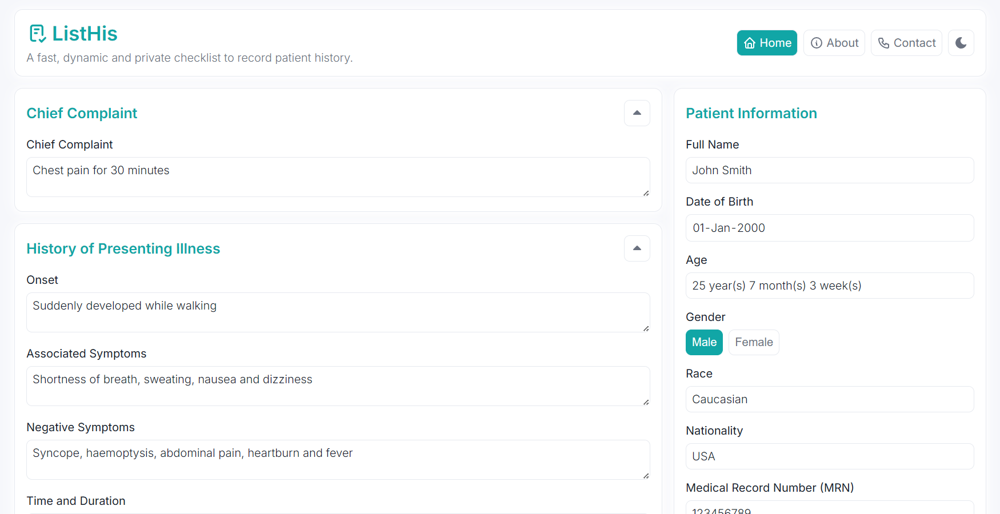

# [ListHis][website-link] <br /> [![status-badge]][website-link] [![codefactor-badge]][codefactor-link]

This repository hosts the source code for the [ListHis][website-link] website, a fast, dynamic and private checklist to record patient history.

<p align="center">
  <picture>
    <source
      srcset="res/cover-image-dark.png"
      media="(prefers-color-scheme: dark)"
    />
    <source
      srcset="res/cover-image-light.png"
      media="(prefers-color-scheme: light), (prefers-color-scheme: no-preference)"
    />
    
  </picture>
</p>

## Features

- Generates a checklist to record patients' medical histories
- Suggests relevant follow-up questions based on the chief complaint or associated symptoms entered
- Exports all entered information as a PDF
- Static, serverless and runs client-side
- Fully responsive layout viewable on all devices
- Available in dark or light themes
- Keyboard-accessible

## Adapting this Project

Feel free to fork this project and customise it for your use.
See the [Quickstart guide](#quickstart "View the Quickstart guide.") for steps on getting started.

If you have any questions, [contact me](https://listhis.pages.dev/contact "Learn how to contact me.").

## Quickstart

Follow these steps to get started with running this project locally.

### Prerequisites

- Git:
  - [Git for Windows](https://git-scm.com/download/win "Download Git for Windows.")
  - [Git for macOS](https://git-scm.com/download/mac "Download Git for macOS.")
  - [Git for Linux](https://git-scm.com/download/linux "Download Git for Linux.")
- Node.js:
  - [Node.js for Windows](https://nodejs.org/en/download "Download Node.js for Windows.")
  - [Node.js for macOS](https://nodejs.org/en/download "Download Node.js for macOS.")
  - [Node.js for Linux](https://nodejs.org/en/download "Download Node.js for Linux.")

### Installation

Follow these steps to install this project locally.

1. Open a CLI (e.g. PowerShell, Terminal, etc.).
2. Navigate to a folder you want to clone this repository into.
3. Clone this repository.

    ```shell
    git clone https://github.com/anipalur/listhis.git
    ```

4. Navigate to the project folder.

    ```shell
    cd listhis
    ```

5. Install all dependencies.

    ```shell
    npm install
    ```

6. Preview the website by opening the `index.html` file.

## Attribution

Thanks to [readme.so](https://readme.so "Visit readme.so!") for helping create this README.md file!

## Licences


**Copyright &copy; 2025 Anitej Palur**  
The source code for this extension is licensed under a [GNU GPLv3 License](https://www.gnu.org/licenses/gpl-3.0.html "Learn more about the GNU GPLv3 License.").

See [LICENSE](/LICENSE "View the LICENSE file.") for more information.

[website-link]: https://listhis.pages.dev "Visit the ListHis website."

[codefactor-badge]: https://img.shields.io/codefactor/grade/github/anipalur/listhis?style=flat-square&logo=codefactor&logoColor=F44A6A&label=Code%20Quality
[codefactor-link]: https://www.codefactor.io/repository/github/anipalur/listhis "View this project's code quality grade."

[status-badge]: https://img.shields.io/website?style=flat-square&up_message=Online&up_color=4CC71E&down_message=Offline&down_color=CF222E&url=https%3A%2F%2Flisthis.pages.dev&&label=Status
